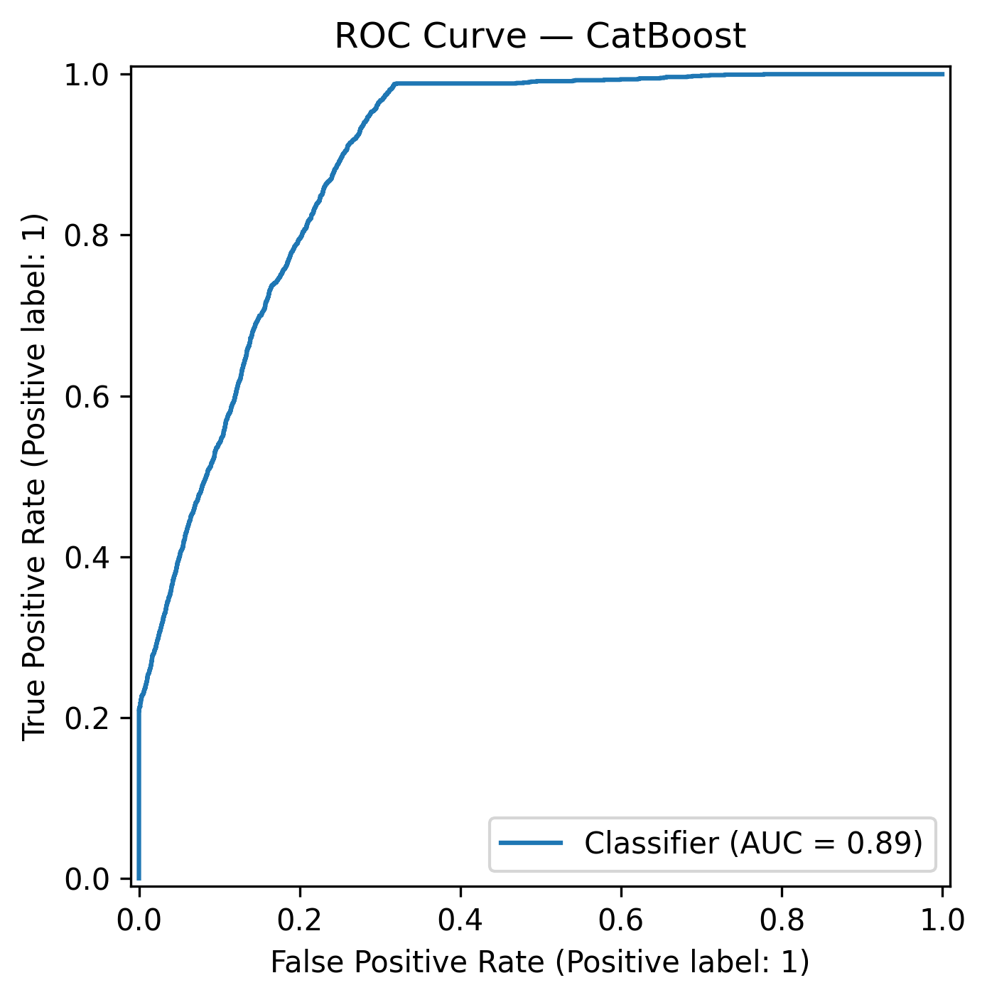
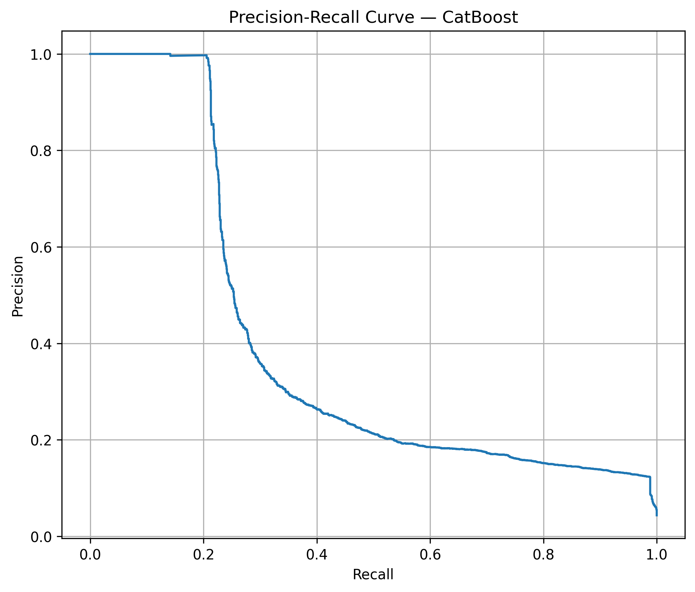
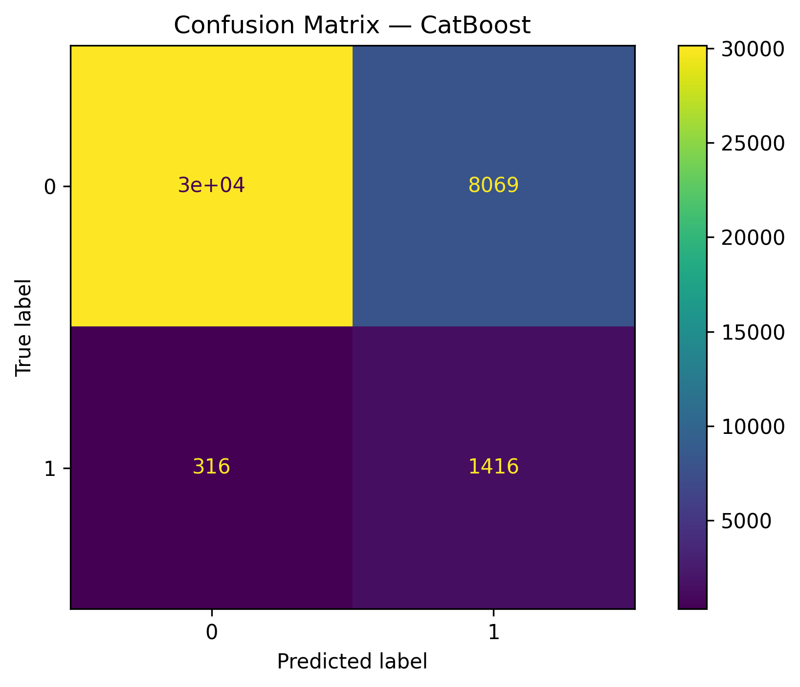
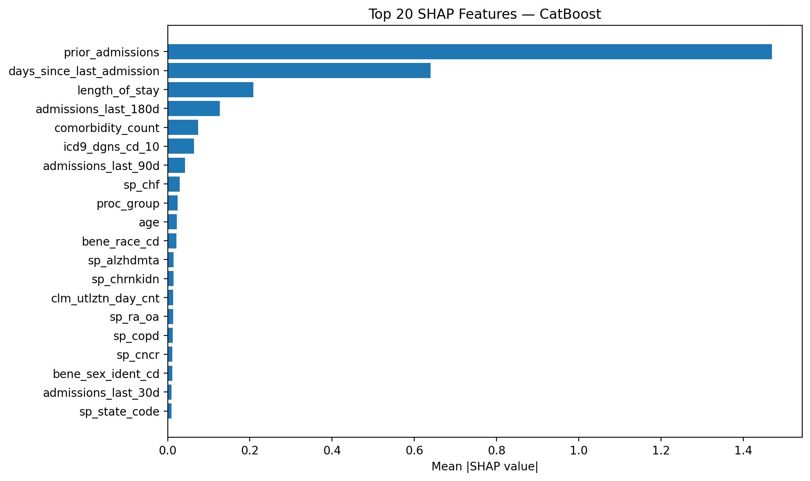
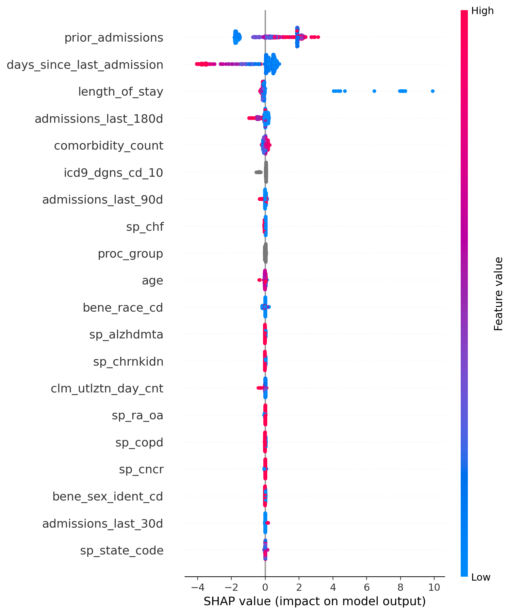
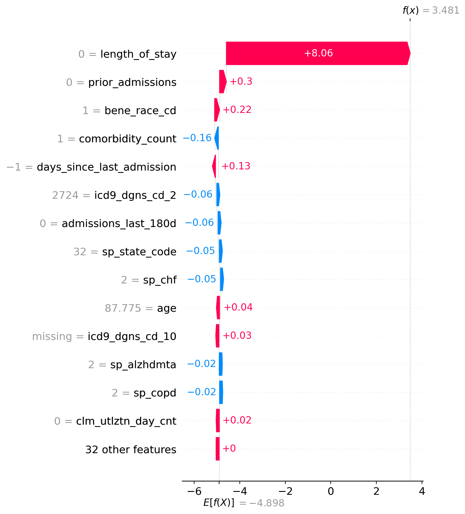
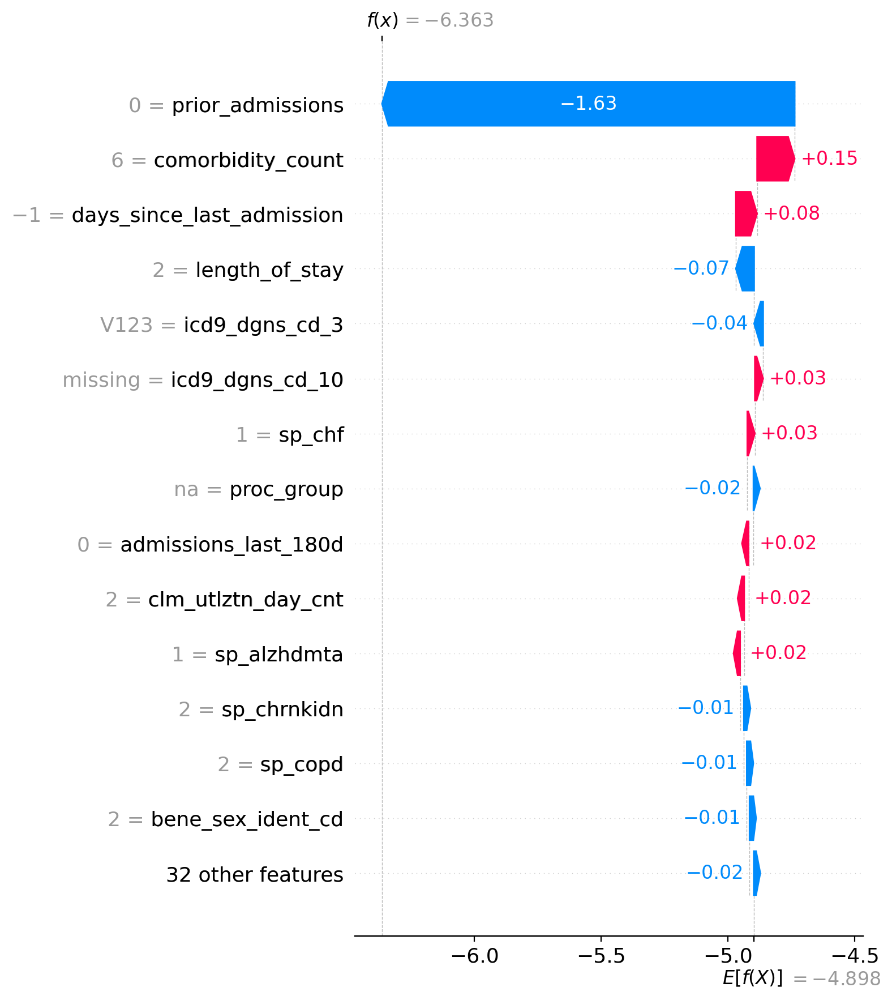
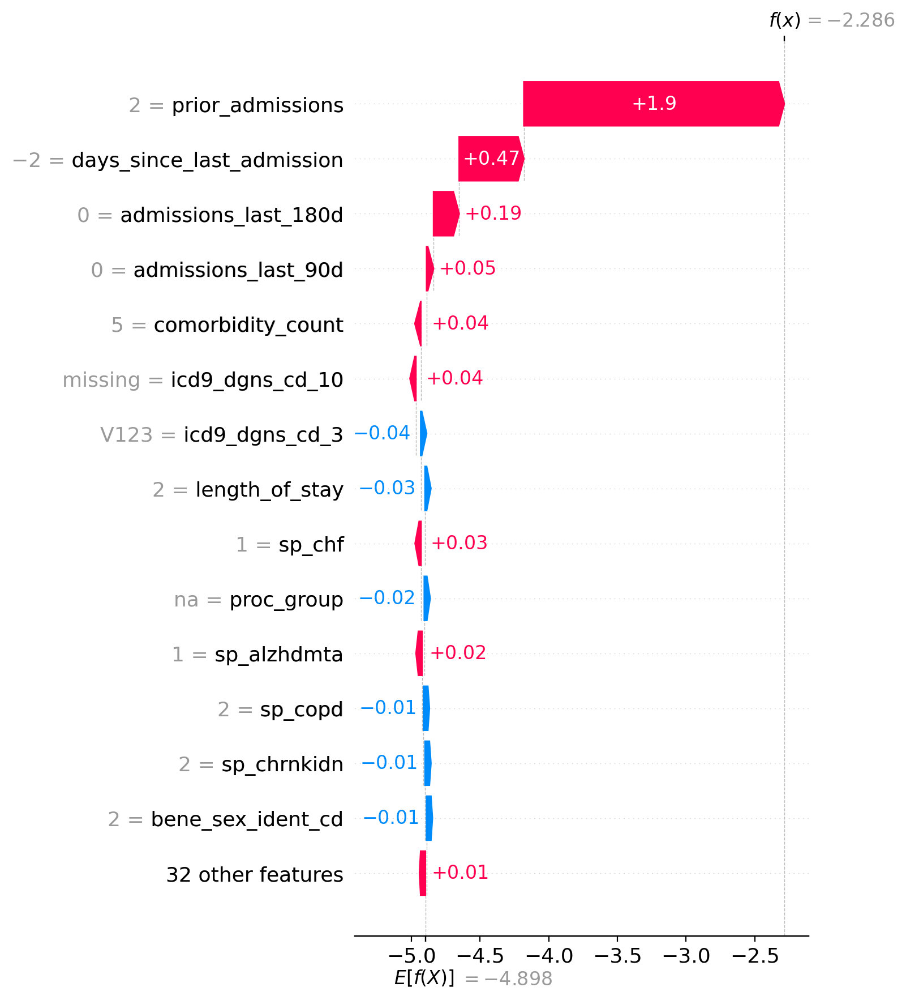
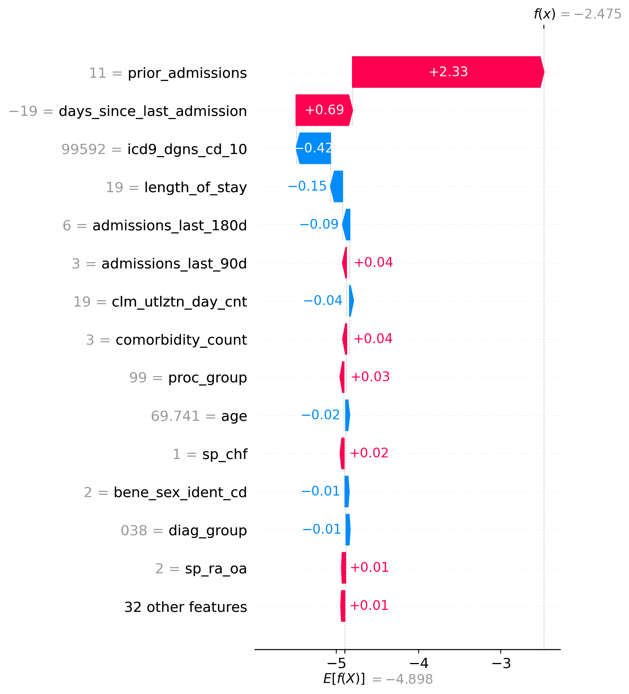

# How Likely Are You to Be Admitted to a Hospital?

## TL;DR:

- ML pipeline using CMS synthetic Medicare claims data
- Engineered temporal and clinical features from longitudinal claims records
- Compared Logistic Regression, Random Forest, XGBoost, LightGBM, and CatBoost models
- Explained model predictions using SHAP
- Tracked experiments and artifacts with MLflow

# Final Report: 30-Day Hospital Admission Risk Prediction Using CMS Synthetic Claims Data

## Abstract

Hospital readmission is an important quality and cost signal in healthcare, and predicting which patients are at elevated risk can assist in earlier intervention and better resource planning. This project provides an end-to-end ML pipeline that uses CMS synthetic Medicare claims data to classify patients based on the probability that they will be admitted to a hospital within 30 days. It includes data cleaning, feature engineering, predictive modeling, model explainability (SHAP), and experiment tracking (MLflow).

Because hospital admission within 30 days is a relatively rare outcome, the dataset classes are imbalanced (with a positive class prevalence of 4.3%). Imbalanced data tends to render accuracy -- that is, (TP+TN) / (TP+TN+FP+FN) -- as an insufficient evaluation metric on its own, so ROC-AUC and Precision-Recall AUC (with more of an emphasis on recall) tend to be more informative evaluation metrics. The final CatBoost model achieved ROC-AUC of 0.892 and Precision-Recall AUC of 0.393.

## Introduction

Predicting hospital readmission is a common healthcare analytics problem because it has direct implications for care coordination, population health management, and operational efficiency. Patients who are likely to return shortly after discharge may benefit from closer follow-up, medication reconciliation, discharge planning, or additional support services. From a data science perspective, readmission prediction is also challenging because the data is often longitudinal, sparse, imbalanced, and encoded using industry-specific billing and diagnosis systems.

This project builds a reproducible admission prediction pipeline using synthetic CMS claims data, with an emphasis on data preparation, feature engineering, model comparison, and explainability. The project aligns closely with common responsibilities in healthcare and biotech data science roles, including preparing AI-ready datasets, training machine learning models, evaluating performance, and documenting results as clearly as possible.

## Dataset and Prediction Target

The analysis uses CMS synthetic claims data, including beneficiary-level demographic and chronic condition information as well as inpatient claim records. Beneficiary data provides demographic variables such as sex, race, age, state, and chronic condition indicators. Inpatient claims provide hospitilization details such as admission and discharge dates, diagnosis codes, procedure codes, and utilization measures.

The prediction target is binary:

1: the patient is admitted within 30 days of discharge
0: the patient is not admitted within 30 days

The target was derived by sorting admissions chronologically at the beneficiary level and measuring the number of days between a discharge and the next admission. A readmission label was assigned when the next admission occurred within 30 days. Negative intervals were treated as invalid and excluded from the label generation logic. The final modeling dataset contained a positive class prevalence of 4.3%.

## Data Cleaning

First, the beneficiary and inpatient files were cleaned separately. Rows with missing beneficiary identifiers were removed, duplicate rows were dropped, and date fields were converted into proper datetime format. Records with impossible date relationships were filtered out, such as discharge dates earlier than admission dates or birth dates inconsistent with death dates. These checks were important because claims data can contain irregularities that would otherwise introduce outlying noise.

Next, the beneficiary and inpatient datasets were merged on the beneficiary identifier. This created a patient-hospitalization table that combined demographic context, chronic condition information, and claim-level utilization details. This harmonized table formed the basis for subsequent feature engineering and modeling.

## Feature Engineering

Several feature families were constructed to capture patient history, hospitalization burden, and clinical complexity.

Temporal variables were derived to reflect the longitudinal nature of claims data and capture utilization intensity and recency. These included:

days_since_last_admission
prior_admissions
admissions_last_7d
admissions_last_14d
admissions_last_30d
admissions_last_90d
admissions_last_180d

Additional engineered variables included:

length_of_stay
clm_utlztn_day_cnt
age
comorbidity_count

Chronic disease indicators for CHF, diabetes, COPD, kidney disease, cancer, depression, etc. were used to create a column called "comorbidity_count" which, as the name intuitively implies, contains the number of comorbidities a patient possesses.

Because raw ICD-9 diagnosis and procedure codes are sparse and have high cardinality, those fields were grouped into broader categories to create more comprehensible summary features. Specifically, diagnosis codes were mapped into the following groups: 

cardiovascular
respiratory
endocrine
kidney
other

and procedure codes were mapped into the following groups:

nervous system
endocrine
ear/nose/throat
cardiovascular
digestive
urinary
musculoskeletal
other

## Modeling Strategy

The modeling process was designed to reflect best practices for imbalanced classification and healthcare data evaluation.

The evaluated models included:

Logistical Regression
Random Forest
XGBoost
LightGBM
CatBoost

Numerical features were standardized and medians were imputed where there were missing values. Categorical features were one-hot encoded where appropriate (obviously categorical features did not need to be preprocessed for CatBoost).

Because the dataset is heavily imbalanced, the primary evaluation metrics were:

ROC-AUC
Precision-Recall AUC
Recall
Precision
F1-score

As mentioned previously in the abstract, accuracy was not used as the main evaluation metric because with imbalanced data, a model can achieve high accuracy by simply predicting the majority class most of the time, so recall and PR-AUC are more informative metrics.

Model selection was based on 5-fold grouped stratified cross-validation at the beneficiary level, followed by holdout evaluation, to ensure that admissions from the same patient were kept within a single fold, preventing patient-level information leakage across training and validation splits. This grouped split strategy helps ensure that reported performance is a realistic estimate of generalization to unseen patients. On the held-out test set, the final CatBoost model achieved ROC-AUC of 0.892 and a Precision-Recall AUC of 0.393. 

These results are meaningful given the low base rate of readmission. A PR-AUC of 0.393 is substantially above the 4.3% prevalence baseline and indicates that the model captures a decent amount of signal beyond chance in a highly imbalanced and ostensibly noisy setting.

It should be noted that because Precision-Recall AUC was the primary evaluation metric, there was an opportunity to adjust the model's decision threshold. The model's decision threshold (0.87) was optimized for high recall (0.82), prioritizing the identification of as many patients at risk of readmission as possible, even at the expense of additional false positives. In a healthcare risk setting, missing high-risk patients is more consequential than issuing some false positive alerts, so when in doubt, it's better to overdiagnose: better safe than sorry.

## Model Performance

### ROC Curve

### Precision–Recall Curve

### Confusion Matrix

### Cross-Validation Results (5-Fold Stratified Group CV)

<table>
<tr>
<td>Model</td>
<td>PR_AUC_Mean</td>
<td>PR_AUC_SD</td>
<td>ROC_AUC_Mean</td>
<td>ROC_AUC_SD</td>
<td>Recall_Mean</td>
<td>Recall_SD</td>
<td>F1_Mean</td>
<td>F1_SD</td>
<td>Accuracy_Mean</td>
<td>Accuracy_SD</td>
</tr>

<tr>
<td>CatBoost</td>
<td>0.406712</td>
<td>0.006147</td>
<td>0.894659</td>
<td>0.003961</td>
<td>0.225384</td>
<td>0.003254</td>
<td>0.366727</td>
<td>0.004391</td>
<td>0.966270</td>
<td>0.000204</td>
</tr>

<tr>
<td>LightGBM</td>
<td>0.395745</td>
<td>0.005587</td>
<td>0.888970</td>
<td>0.002688</td>
<td>0.220618</td>
<td>0.003515</td>
<td>0.357710</td>
<td>0.004673</td>
<td>0.965669</td>
<td>0.000179</td>
</tr>

<tr>
<td>XGBoost</td>
<td>0.389530</td>
<td>0.006614</td>
<td>0.885104</td>
<td>0.002428</td>
<td>0.929112</td>
<td>0.007195</td>
<td>0.226636</td>
<td>0.001097</td>
<td>0.725220</td>
<td>0.001272</td>
</tr>

<tr>
<td>Random Forest</td>
<td>0.132620</td>
<td>0.037050</td>
<td>0.749246</td>
<td>0.045368</td>
<td>0.624631</td>
<td>0.049773</td>
<td>0.161922</td>
<td>0.019914</td>
<td>0.717180</td>
<td>0.033828</td>
</tr>

<tr>
<td>Logistic Regression</td>
<td>0.058753</td>
<td>0.002372</td>
<td>0.580354</td>
<td>0.005586</td>
<td>0.262777</td>
<td>0.013213</td>
<td>0.101661</td>
<td>0.004636</td>
<td>0.798769</td>
<td>0.002687</td>
</tr>
</table>

### Holdout Test Set

<table>
<tr>
<td>Model</td>
<td>Accuracy</td>
<td>Precision</td>
<td>Recall</td>
<td>F1</td>
<td>ROC_AUC</td>
<td>PR_AUC</td>
</tr>

<tr>
<td>CatBoost</td>
<td>0.790149</td>
<td>0.149288</td>
<td>0.817552</td>
<td>0.252474</td>
<td>0.892288</td>
<td>0.393344</td>
</tr>
</table>

## Model Explainability

For model transparency, the final model was analyzed using SHAP (SHapley Additive exPlanations), quantifying how much each feature contributes to an individual prediction while also providing a broader view of feature importance across the dataset.

### Global Feature Attribution

Global SHAP analysis identified features that most strongly influenced predictions across all patients. Temporal utilization variables -- such days since previous admission, number of prior admissions, and the duration of the previous stay were among the most influential patterns. Clinical characteristics, including the number of chronic condition indicators (represented in comorbidity count) and diagnosis groups also contributed substantially to predicted readmission risk, although less so than the temporal variables.

The global feature importance summary confirmed that the model relied primarily on clinically plausible predictors rather than demographic variables alone, increasing confidence that the relationships learned by the model align with expected heuristics regarding recent hospitalizations and greater disease burden.

The SHAP bar plot below provides a simplified ranking of the features with the greatest overall impact on model predictions.

The SHAP summary plot below shows the destribution and magnitude of feature contributions across the evaluation dataset.

### Patient-Level Explanations

In addition to global interpretation, SHAP was used to explain individual predictions. Waterfall plots illustrate how specific patient characteristics increase or decrease the predicted probability of a readmission in 30 days. Features pushing the prediction toward higher readmission risk are shown as positive contributions, while features pushing the prediction toward lower risk reduce the prediction.

For example, a patient-level explanation can reveal whether factors such as recent hospitalization history, prior admissions, length of stay, comorbidity burden, utilization, and diagnosis groups conributed to an elevated predicted risk.

Representative examples were generated for true positives, false positives, true negatives, and false negatives to better understand model behavior and identify common sources of prediction error across different model outcomes.

Again, the waterfall plots below merely describe how the model arrives at a prediction; they do not establish that a feature cause the patient's readmission. Thus, these explanations should be interpreted as model behavior rather than clinical causality. As one can see, for true positives, length of stay seems to be an important feature, but for false positives, true negatives, and false negatives, prior admissions seems to be a more important feature. Perhaps one should be wary when prior admissions plays a larger role than length of stay on predicting the target feature values of unseen data.

## Experiment Tracking and Reproducibility

To improve experiment traceability and model reproducibility from feature preparation and model selection through final evaluation and explainability, MLflow was incorporated into the modeling workflow. Model runs can be tracked with their associated parameters, evaluation metrics, metadata, and output artifacts, making it possible to compare experiments and maintain a record of how results were produced.

Such key model artifacts and metadata include:
 - Final trained model
 - Cross-validation performance metrics
 - Holdout test-set metrics and predictions
 - Selected decision threshold
 - Model name and configuration
 - Categorical and numerical feature lists
 - SHAP feature-importance results and explainability figures

The modeling workflow uses fixed random seeds and 5-fold Stratified Group Cross-Validation at the beneficiary level to make evaluation consistent and prevent patient-level data leakage between folds. 

## Limitations

This project ahs several important limitations that should be considered when interpreting the results. 

First, the analysis uses CMS synthetic claims data. Although th edataset provides a realistic environment for developing and evaluating a healthcare machine learning workflow, model performance should not be interpreted as evidence of clinical effectiveness or expected performance on real patient populations.

Second, claims data primarily captures diagnoses, procedures, utilization, and administrative information. They do not provide many potentially predictive clinical signals scuh as laboratory values, vital signs, medications, clinical notes, or detailed measures of patient condition. Nor do they provide factors that may not be captured in claims data at all, including social determinants of health, access to follow-up care, medication adherence, caregiver support, and hospital-specific discharge and care-coordination practices. The absense of these variables may limit predictive performance.

Third, the model should be interpreted according to the point in the care process at which length of stay and utilization measures become available.

Fourth, only 4.3% of observations represent 30-day readmissions. This imbalance makes accuracy a poor primary metric an dcreates an inherent precision-recall tradeoff. The model's decision threshold was therefore selected with an emphasis on recall, and the resulting precision should be considered when interpreting potential use cases.

Fifth, the final model was evaluated using a held-out subset of the same underlying dataset. Although beneficiary-level grouping was used to reduce information leakage, performance has not been independently validated on a separate real-world population or external dataset.

Sixth, results may vary depending on the definition of 30-day readmission, feature engineering decisions, preprocessing methods, model hyperparameters, decision threshold, and train/test splitting strategies.

## Conclusion

This project demonstrates a complete healthcare machine learning workflow using CMS synthetic claims data. Starting from raw beneficiary and inpatient files, the project cleaned and harmonized longitudinal claims records, engineered temporal and utilization features, trained and compared multiple machine learning models, and evaluated them using metrics appropriate for an imbalanced outcome. The final CatBoost model achieved a ROC-AUC of 0.892 and a PR-AUC of 0.393 on a dataset with 4.3% positive prevalence. Beyond model performance, the project emphasizes reproducibility, patient-level data leakage prevention, explainability, and experiment tracking.